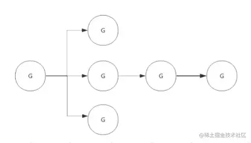
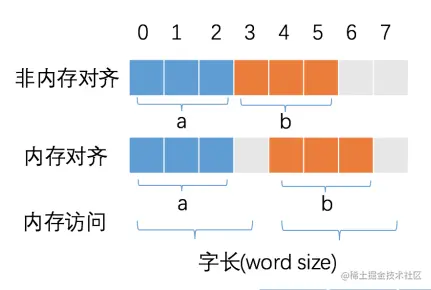

# GO

## 垃圾回收

垃圾回收就是对程序中不再使用的内存资源进行自动回收的操作。

### 常见的垃圾回收算法

- 引用计数：每个对象维护一个引用计数，当被引用对象被创建或被赋值给其他对象时引用计数自动加 +1，如果这个对象被销毁，则计数 -1 ，当计数为 0 时，回收该对象。
  - 优点：对象可以很快被回收，不会出现内存耗尽或到达阀值才回收。
  - 缺点：不能很好的处理循环引用。
- 标记-清除：从根变量开始遍历所有引用的对象，引用的对象标记“被引用”，没有被标记的则进行回收。
  - 优点：解决了引用计数的缺点。
  - 缺点：需要 STW（stop the world），暂时停止程序运行。
- 分代回收：按照对象生命周期长短划分不同的代空间，生命周期长的放入老年代，短的放入新生代，不同代有不同的回收算法和回收频率。
  - 优点：回收性能好。
  - 缺点：算法复杂。

### 三色标记法

- 初始状态下所有对象都是白色的。
- 从根节点开始遍历，把遍历到的对象变成灰色对象。
- 遍历灰色对象，将灰色对象引用的对象也变成灰色对象，同时将自己变成黑色对象。
- 循环步骤 3，直到灰色对象全部变黑色。
- 通过写屏障 (write-barrier) 检测对象有变化，重复以上操作（备注：因为标记和用户程序是并行的，所以在上一步执行的时候可能会有新的对象分配，写屏障是为了解决这个问题引入的）。
- 收集所有白色对象（垃圾）。

### 根对象

- 全局变量：程序在编译期就能确定的那些存在于程序整个生命周期的变量。
- 执行栈：每个 goroutine 都包含自己的执行栈，这些执行栈上包含**栈上的变量**及**指向分配的堆内存区块的指针**。
- 寄存器：寄存器的值可能表示一个指针，参与计算的这些指针可能指向某些已分配的堆内存区块。

### STW（Stop The World）

- 为了避免在 GC 的过程中，对象之间的引用关系发生新的**变更**，使得 GC 的结果发生错误（如 GC 过程中新增了一个引用，但是由于未扫描到该引用导致将被引用的对象清除了），停止所有正在运行的协程。
- STW 对性能有一些影响，Go 目前已经可以做到 1ms 以下的 STW。

### 写屏障（Write Barrier）

为了避免 GC 的过程中新修改的引用关系使 GC 的结果发生错误，我们需要进行 STW，但是 STW 会影响程序的性能，所以我们要通过写屏障技术尽可能地缩短 STW 的时间。

### 混合写屏障机制（Go v1.8）

- GC 刚开始的时候，会将栈上的可达对象全部标记为**黑色**。
- GC 期间，任何在栈上新创建的对象，均为**黑色**。
- 堆上被删除的对象标记为**灰色**。
- 堆上新添加的对象标记为**灰色**。

**备注：写屏障只应用在堆上。**

### GC 流程（Go v1.8）

- **STW (Stop The World) 并开启写屏障**，记录根对象的必要信息。
- Start The World 并开始标记，此时用户程序和 GC 标记并发执行。
- **标记完成再次 STW，关闭写屏障**。
- Start The World 进入清除阶段。

### Go 的内存模型中为什么小对象多了会造成 GC 压力？

通常小对象过多会导致 GC 三色法消耗过多的 CPU，优化思路是，减少对象分配。

### GC 的触发条件？

- 主动触发（手动触发），通过调用 `runtime.GC()` 来触发 GC，此调用阻塞式地等待当前 GC 运行完毕。
- 被动触发，分为两种方式：
  - 使用系统监控，当超过两分钟没有产生任何 GC 时，强制触发 GC。
  - 使用步调（Pacing）算法，其核心思想是控制内存增长的比例，每次内存分配时检查当前内存分配量是否已达到阈值（环境变量GOGC），默认100%，即当内存扩大一倍时启用 GC。

### 辅助 GC（Mutator Assist）

为了防止内存分配过快，在 GC 执行过程中，如果 goroutine 需要分配内存，那么这个 goroutine 会参与一部分 GC 的工作，即帮助 GC 做一部分工作，这个机制叫作 Mutator Assist。

## GPM 调度 和 CSP 模型

### CSP 模型？

CSP 模型是“以通信的方式来共享内存”，不同于传统的多线程通过共享内存来通信。CSP 模型指的是两个独立的并发实体通过共享的通讯 channel （管道）进行通信的并发模型。

### GPM 分别是什么、分别有多少数量？

- G: 表示 Goroutine，每个 Goroutine 对应一个 G 结构体，G 存储 Goroutine 的运行堆栈、状态以及任务函数，可重用。G 并非执行体，每个 G 需要绑定到 P 才能被调度执行。
- P: Processor，表示逻辑处理器， 对 G 来说，P **相当于** CPU 核，G 只有绑定到 P（在 P 的 local runq 中）才能被调度。对 M 来说，P 提供了相关的执行环境（Context），如内存分配状态（mcache），任务队列（G）等，P 的数量决定了系统内最大可**并行**的 G 的数量（前提：物理 CPU 核数 >= P 的数量），P 的数量由用户设置的 `runtime.GOMAXPROCS()` 决定，但是不论 `runtime.GOMAXPROCS()` 设置为多大，P 的数量最大为 256。
- M: Machine，OS 线程抽象，代表着真正执行计算的资源，在绑定有效的 P 后，进入 schedule 循环，而 schedule 循环的机制大致是从 Global 队列、P 的 Local 队列以及 wait 队列中获取 G，切换到 G 的执行栈上并执行 G 的函数，调用 `goexit` 做清理工作并回到 M，如此反复。M 并不保留 G 状态，这是 G 可以跨 M 调度的基础，M 的数量是不定的，由 Go Runtime 调整，为了防止创建过多 OS 线程导致系统调度不过来，目前默认最大限制为 10000 个。

### Goroutine 调度策略

- 队列轮转：P 会周期性的将 G 调度到 M 中执行，执行一段时间后，保存上下文，将 G 放到队列尾部，然后从队列中再取出一个 G 进行调度。除此之外，P 还会周期性的查看全局队列是否有 G 等待调度到 M 中执行。
- 系统调用：当 G0 即将进入系统调用时，M0 将释放 P，进而某个空闲的 M1 获取 P，继续执行 P 队列中剩下的 G。M1 的来源有可能是 M 的**缓存池**，也可能是新建的。
  当 G0 系统调用结束后，如果有空闲的 P，则获取一个 P，继续执行 G0。如果没有，则将 G0 放入全局队列，等待被其他的 P 调度。然后 M0 将进入**缓存池**睡眠。

  

### M 的状态有哪些？

**自旋线程**：处于运行状态但是没有可执行 goroutine 的线程，数量最多为 `runtime.GOMAXPROCS(-1)` ，若是数量大于 `runtime.GOMAXPROCS(-1)` 就会进入休眠。

**非自旋线程**：处于运行状态有可执行 goroutine 的线程。

### `runtime.GOMAXPROCS` 设置过大会怎样？

`runtime.GOMAXPROCS(num int)` 可以设置 P 数目，该值默认为 CPU 逻辑核数，如果设的太大（意味着 M 会很大），会引起频繁的 OS 线程切换，降低性能。对于 I/O 密集型可以设置大一些。

### 怎么查看 Goroutine 的数量？怎么限制 Goroutine 的数量？

- `runtime.GOMAXPROCS(-1)` 查看的是未被阻塞的所有 Goroutine 数量，通过 `runtime.NumGoroutine()` 可以查看所有 Goroutine 的数量。
- 使用通道，每次执行的 go 之前向通道写入值，直到通道满的时候就阻塞了。

`runtime` 包是 Go 语言的运行时系统，提供了与底层系统交互和控制的功能，它包含了与内存管理、垃圾回收、协程调度等相关的函数和变量。

### 常见的 Goroutine 操作函数有哪些？

`runtime.Gosched()`，用于让出 CPU 时间片，让出当前 goroutine 的执行权限，调度器安排其它等待的任务运行，并在下次某个时候从该位置恢复执行。
`runtime.Goexit()`，调用此函数会立即使当前的 goroutine 的运行终止（终止协程），而其它的 goroutine 并不会受此影响，在终止当前 goroutine 前会先执行此 goroutine 的还未执行的 `defer` 语句。请注意千万别在主函数调用`runtime.Goexit()`，因为会引发 `panic`。

### Go 为什么快？

一个 goroutine 会以一个很小的栈启动（2KB - 4KB），当遇到栈空间不足时，栈会自动伸缩，因此可以轻易实现成千上万个 goroutine同时启动。

### 协程和线程和进程的区别？

- 进程：进程都有自己的独立内存空间，不同进程通过进程间通信来通信，上下文进程间的切换开销（栈、寄存器、虚拟内存、文件句柄等）比较大，但相对比较稳定安全。
- 线程：线程间通信主要通过共享内存，上下文切换很快，资源开销较少，但相比进程不够安全。
- 协程：协程是一种用户态的轻量级线程，协程的调度完全是由运行时来控制的，拥有自己的寄存器上下文和栈，上下文的切换非常快。

## `chan` 原理

### 结构体

```go
type hchan struct {
 qcount   uint  // 队列中的总元素个数
 dataqsiz uint  // 环形队列大小，即可存放元素的个数
 buf      unsafe.Pointer // 环形队列指针
 elemsize uint16  // 每个元素的大小
 closed   uint32  // 标识关闭状态
 elemtype *_type // 元素类型
 sendx    uint   // 发送索引，元素写入时存放到队列中的位置

 recvx    uint   // 接收索引，元素从队列的该位置读出
 recvq    waitq  // 等待读消息的 goroutine 队列
 sendq    waitq  // 等待写消息的 goroutine 队列
 lock mutex  // 互斥锁，chan 不允许并发读写
}
```

### 读写流程

> 向  channel 写数据:
>
> 1. 若等待接收队列  recvq 不为空，则缓冲区中无数据或无缓冲区，将直接从 recvq 取出 G ，并把数据写入，最后把该 G 唤醒，结束发送过程。
> 2. 若缓冲区中有空余位置，则将数据写入缓冲区，结束发送过程。
> 3. 若缓冲区中没有空余位置，则将发送数据写入 G，将当前 G 加入 sendq ，进入睡眠，等待被读  goroutine 唤醒。

> 从 channel 读数据
>
> 1. 若等待发送队列  sendq 不为空，且没有缓冲区，直接从 sendq 中取出 G ，把 G 中数据读出，最后把 G 唤醒，结束读取过程。
> 2. 如果等待发送队列 sendq 不为空，说明缓冲区已满，从缓冲区中首部读出数据，把 G 中数据写入缓冲区尾部，把 G 唤醒，结束读取过程。
> 3. 如果缓冲区中有数据，则从缓冲区取出数据，结束读取过程。
> 4. 将当前 goroutine 加入 recvq ，进入睡眠，等待被写 goroutine 唤醒。

> 关闭 channel
>
> 1.关闭 channel 时会将 recvq 中的 G 全部唤醒，本该写入 G 的数据位置为 nil。将 sendq 中的 G 全部唤醒，但是这些 G 会 panic。
>
> panic 出现的场景还有：
>
> - 关闭值为 nil 的 channel
> - 关闭已经关闭的 channel
> - 向已经关闭的 channel 中写数据

### 无缓冲 `chan` 的发送和接收是否同步?

无缓冲时，发送阻塞直到数据被接收，接收阻塞直到读到数据，有缓冲时，当缓冲满时发送阻塞，当缓冲空时接收阻塞。

```go
// 无缓冲的 channel 由于没有缓冲发送和接收需要同步
ch := make(chan int)   
// 有缓冲 channel 不要求发送和接收操作同步
ch := make(chan int, 2)  
```

### `chan` 状态有哪些？

`chan` 是异步进行的， `chan` 存在 3 种状态：

- `nil`，未初始化的状态，只进行了声明，或者手动赋值为 `nil`
- `active`，正常的 `chan`，可读或者可写
- `closed`，已关闭，千万不要误认为关闭 `chan` 后，`chan` 的值是 `nil`

| 操作     | 一个零值 nil 通道 | 一个非零值但已关闭的通道 | 一个非零值且尚未关闭的通道 |
| -------- | ----------------- | ------------------------ | -------------------------- |
| 关闭     | 产生恐慌          | 产生恐慌                 | 成功关闭                   |
| 发送数据 | 永久阻塞          | 产生恐慌                 | 阻塞或者成功发送           |
| 接收数据 | 永久阻塞          | 永不阻塞                 | 阻塞或者成功接收           |

### `chan` 为什么它可以做到线程安全？

`chan` 可以理解是一个先进先出的队列，数据在出队和入队时也加了锁。

## `context` 原理

### 用途

`context`（上下文）是 Go 应用开发常用的并发控制技术 ，它可以控制一组呈树状结构的 goroutine，每个 goroutine 拥有相同的上下文。`context` 是并发安全的，主要是用于控制多个协程之间的协作、取消操作。



### 数据结构

`context` 只定义了接口，凡是实现该接口的类都可称为是一种 `context`。

```go
type Context interface {
   Deadline() (deadline time.Time, ok bool)
   Done() <-chan struct{}
   Err() error
   Value(key interface{}) interface{}
}
```

- `Deadline()` 方法：可以获取设置的截止时间，返回值 `deadline` 是截止时间，到了这个时间，`context` 会自动发起取消请求，返回值 `ok` 表示是否设置了截止时间。
- `Done()` 方法：返回一个只读的 `channel` ，类型为 `struct{}`。如果这个 `chan` 可以读取，说明已经发出了取消信号，可以做清理操作，然后退出协程，释放资源。
- `Err()` 方法：返回 `context` 被取消的原因。
- `Value()` 方法：获取 `context` 上绑定的值，是一个键值对，通过 `key` 来获取对应的值。

## 内存逃逸

### 逃逸分析？

逃逸分析是 Go 语言的一项优化技术，可以在编译期间分析代码，确定变量的生命周期和分配位置，从而避免不必要的内存分配和垃圾回收。通过逃逸分析的优化，可以有效地提高程序的性能和可靠性。代价是在堆上分配内存比较慢，而且会形成内存碎片。

逃逸场景：

- 指针逃逸（例如函数返回指针）。
- 栈空间不足逃逸。
- 动态类型逃逸。
- 闭包引用对象逃逸。

### 函数返回局部变量的指针是否安全？

这一点和 C++不同，在 Go 里面返回局部变量的指针是安全的，因为 Go 会进行**逃逸分析**，如果发现局部变量的作用域超过该函数则会**把指针分配到堆区**。

## 并发

### 什么是竞态？

资源竞争，就是在程序中，同一块内存同时被多个 goroutine 访问。 我们使用 `go build、go run、go test` 命令时，添加 `-race` 标识可以检查代码中是否存在资源竞争。

为了解决这个问题，我们可以给资源进行加锁或者使用原子操作 `atomic` 包等方法，让其在同一时刻只能被一个协程来操作。

- `sync.Mutex`
- `sync.RWMutex`

### Go 语言中的并发安全性是什么？如何确保并发安全性？

并发安全性是指在并发编程中，多个 goroutine 对**共享资源**的访问不会导致**数据竞争**和**不确定的结果**。

为了确保并发安全性，可以采取以下措施：

- **使用互斥锁：**通过使用互斥锁来保护共享资源的访问，一次只允许一个 goroutine 访问共享资源，从而避免竞争条件。
- **使用原子操作：**对于简单的读写操作，可以使用原子操作来保证操作的原子性，避免竞争条件。
- **使用通道：**通过使用通道来进行 goroutine 之间的通信和同步，避免共享资源的直接访问。
- **使用同步机制：**使用同步机制 `WaitGroup`、`Cond` 等来协调多个 goroutine 的执行顺序和状态。

通过以上措施，可以确保并发程序的安全性，避免数据竞争和不确定的结果。

### Go 中除了加 `Mutex` 锁以外还有哪些方式可以安全读写共享变量？

除了互斥锁以外，还有原子操作、通道和 `waitGroup`、`Cond` 等同步机制。

### 解释一下并发编程中的自旋状态？

自旋状态是并发编程中的一种状态，指的是线程或进程在等待某个条件满足时，不会进入休眠或阻塞状态，而是通过不断地检查条件是否满足来进行忙等待。

在自旋状态下，线程会反复执行一个忙等待的循环，直到条件满足或达到一定的等待时间。 这种方式可以减少线程切换的开销，提高并发性能。然而，**自旋状态也可能导致 CPU 资源的浪费，因为线程会持续占用 CPU 时间片，即使条件尚未满足。**

自旋状态通常用于以下情况：

- 在多处理器系统中，等待某个共享资源的释放，以**避免线程切换的开销**。
- 在短暂的等待时间内，期望条件能够快速满足，从而**避免进入阻塞状态的开销**。

需要注意的是，自旋状态的使用应该谨慎，并且需要根据具体的场景和条件进行评估，如果自旋时间过长或条件不太可能很快满足，那么使用自旋状态可能会浪费大量的 CPU 资源，在这种情况下，更适合使用阻塞或休眠等待的方式。

### Go 如何实现原子操作？

`sync/atomic` 包。

### Go 主协程如何等其余协程完再操作？

使用 `sync.WaitGroup`。`WaitGroup`，就是用来等待一组操作完成的。`WaitGroup` 内部实现了一个计数器，用来记录未完成的操作个数。`Add()` 用来添加计数，`Done()` 用来在操作结束时调用，使计数减一，`Wait()` 用来等待所有的操作结束，即计数变为 0，该函数会在计数不为 0 时等待，在计数为 0 时立即返回。

```go
func TestWaitgroup(t *testing.T) {
   var wg sync.WaitGroup
   wg.Add(2)
   go func() {
      sendHttpRequest("https://baidu.com")
      wg.Done()
   }()
   go func() {
      sendHttpRequest("https://baidu.com")
      wg.Done()
   }()
   wg.Wait()
}
```

### 是否可以并发访问 `map`？

不可以，`map` 不是并发安全的，在多个 goroutine 之间使用 `map` 时需要进行加锁，避免并发访问导致的竞态问题。（`slice` 也不是并发安全的）

### 怎么处理对 `map` 进行并发访问？

使用 `sync.Map` 类型，或原生 `map`+互斥锁（`Mutex`）、原生 `map`+读写锁（`RwMutex`）。

### 原子操作和锁的区别是什么？

原子操作和锁是并发编程中常用的两种同步机制，它们的区别如下：

1. 作用范围：
   - 原子操作（Atomic Operations）：原子操作是一种基本的操作，可以在单个指令级别上执行，保证操作的原子性。原子操作通常用于对共享变量进行读取、写入或修改等操作，以确保操作的完整性。
   - 锁（Lock）：锁是一种更高级别的同步机制，用于保护临界区（Critical Section）的访问。锁可以用于限制对共享资源的并发访问，以确保线程安全。
2. 使用方式：
   - 原子操作：原子操作是通过硬件指令或特定的原子操作函数来实现的，可以直接应用于变量或内存位置，而无需额外的代码。
   - 锁：锁是通过编程语言提供的锁机制来实现的，需要显式地使用锁的相关方法或语句来保护临界区的访问。
3. 粒度：
   - 原子操作：原子操作通常是针对单个变量或内存位置的操作，可以在非常细粒度的层面上实现同步。
   - 锁：锁通常是针对一段代码或一组操作的访问进行同步，可以控制更大粒度的临界区。
4. 性能开销：
   - 原子操作：原子操作通常具有较低的性能开销，因为它们是在硬件级别上实现的，无需额外的同步机制。
   - 锁：锁通常具有较高的性能开销，因为它们需要进行上下文切换和线程同步等操作。

## 语法

### `defer` 作用、执行顺序、在什么情况下可以修改返回值？

**作用：**`defer` 作为延迟函数，可以进行释放资源、捕获 `panic` 等收尾工作（`defer` 函数应紧跟在资源打开后面，否则 `defer` 可能得不到执行，导致内存泄露）。

**执行顺序：** LIFO（后入先出），`defer` 的操作可以理解为压栈。

**修改返回值：**执行顺序：首先 `return`，其次 `return value`，最后 `defer`。当函数返回为**有名返回值**或者**指针**的情况下，`defer` 可以修改函数最终返回值。（对于匿名返回值，执行 `return` 语句后，Go 会创建一个临时变量保存返回值，对于有名返回值，执行 `return` 语句时，并不会再创建临时变量保存）

```go
package main

import (
    "fmt"
    "os"
)

func main() {
    file, err := os.Open("file.txt")
    if err != nil {
        fmt.Println("Error opening file:", err)
        return
    }
    defer func() {
        err := file.Close()
        if err != nil {
            fmt.Println("Error closing file:", err)
        }
    }()
    // 一些操作
    fmt.Println("File operations completed")
}
```

### **讲讲 Go 的 `defer` 底层数据结构和一些特性？**

每个 `defer` 语句都对应一个 `defer` 实例，多个实例使用指针连接起来形成一个单连表，保存在  `groutine` 数据结构中，每次插入 `defer` 实例，均插入到链表的头部，函数结束再一次从头部取出，从而形成后进先出的效果。

**`defer` 总结**：

延迟函数的参数是 `defer` 语句出现的时候就已经确定了的。

延迟函数执行按照后进先出的顺序执行，即先出现的 `defer` 最后执行。

延迟函数可能操作主函数的返回值。

申请资源后立即使用 `defer` 关闭资源是个好习惯。

### `init()` 函数是什么时候执行的？

在 `main()` 函数之前执行，`init()` 函数是 Go 初始化的一部分，由 runtime 初始化每个导入的包，初始化不是按照从上到下的导入顺序，而是按照解析的依赖关系，没有依赖的包最先初始化。

每个包首先初始化包作用域的常量和变量（常量优先于变量），然后执行包的 `init()` 函数。同一个包，甚至是同一个源文件可以有多个 `init()` 函数，`init()` 函数没有入参和返回值，不能被其他函数调用，同一个包内多个 `init()` 函数的执行顺序不作保证。

执行顺序：`import –> const –> var –> init() –> main()`

### Go 中 `new` 和 `make` 的区别？

- `make` 仅用来分配及初始化类型为 `slice、map、chan` 的变量。
- `new` 可分配任意类型的变量，根据传入的类型申请一块内存，返回指向这块内存的**指针**，即类型 `*Type`。
- **`make` 返回引用**，即 `Type`，`new` 分配的空间被清零，`make` 分配空间后，会进行初始。

### Go 中的 `panic` 和 `recover` 有什么作用？请给出使用 `panic` 和 `recover` 的示例

`panic` 和 `recover` 是 Go 语言中用于处理异常的机制。当程序遇到无法处理的错误时，可以使用 `panic` 引发一个异常，中断程序的正常执行。而 `recover` 用于捕获并处理 `panic` 引发的异常，使程序能够继续执行。

**注意：**1. `recover()` 必须在 `defer` 闭包中才能捕获异常；2. 只有在非常严重的情况下才使用 `panic` （例如程序启动时无法连接数据库）

```go
package main

import "fmt"

func divide(a, b int) int {
    defer func() {
        if err := recover(); err != nil {
            fmt.Println("Error:", err)
        }
    }()

    if b == 0 {
        panic("division by zero")
    }
  
    return a / b
}

func main() {
    result := divide(10, 0)
    fmt.Println("Result:", result)
}
```

### Go 语言函数传参是值类型还是引用类型？

- 在 Go 语言中只存在**值传递**，要么是值的副本，要么是指针的副本。无论是值类型的变量还是引用类型的变量亦或是指针类型的变量作为参数传递都会发生值拷贝，开辟新的内存空间。**对于值类型，使用指针传递大型数据结构和在函数间共享数据时非常有用（注意: 结构体是值类型）。**
- 另外值传递、引用传递和值类型、引用类型是两个不同的概念，不要混淆了。引用类型作为变量传递可以影响到函数外部是因为发生值拷贝后新旧变量指向了相同的内存地址。

### Go 值接收者和指针接收者的区别？

类型方法:

- 值接收者，既可以调用值接收者的方法，也可以调用指针接收者的方法。
- 指针接收者，既可以调用指针接收者的方法，也可以调用值接收者的方法。

接口实现：

- 以值类型接收者实现接口，类型本身和该类型的指针类型，都实现了该接口。
- 以指针类型接收者实现接口，**只有对应的指针类型才被认为实现了接口**。

通常我们使用指针作为方法的接收者的理由：

- 使用指针方法能够修改接收者指向的值。
- 可以避免在每次调用方法时复制该值，在值的类型为大型结构体时，这样做会更加高效。

### 非接口的任意类型 `T()` 都能够调用 `*T` 的方法吗？反过来呢？

一个T类型的值可以调用 `*T` 类型声明的方法，当且仅当 `T` 是**可寻址的**，反之，`*T` 可以调用 `T` 的方法，因为指针可以解引用。

### 请你讲一下 Go 面向对象是如何实现的？

Go 实现面向对象的两个关键是 `struct` 和 `interface`。

**封装：**对于同一个包， `struct` 和 `interface`对包内的文件可见；对不同的包，需要将其以大写开头才是可见的。

**”继承“：**Go 中的”继承“其实是组合，在 `struct` 内嵌入其他类即可。

**多态：**多态是运行时特征，Go 多态通过 `interface` 来实现，类型和接口是松耦合的，某个类型的实例可以赋给它所实现的任意接口类型的变量。

Go 以组合的方式实现了”多继承“的效果，就是在类型中嵌入所有必要的父类型。

### Go 中如何实现单例模式？

可以通过 `sync.Once` 包来实现单例模式。该包中 `Once` 结构体只会执行一次函数，可以用于创建单例对象。

### `for range` 的时候它的地址会发生变化么？

在 `for a,b := range c` 遍历中， `a` 和 `b` 在内存中只会存在一份，即之后每次循环时遍历到的数据都是以值覆盖的方式赋给 `a` 和 `b`，`a`、`b` 的内存地址始终不变。由于有这个特性，`for` 循环里面如果开协程，不要直接把 `a` 或者 `b` 的地址传给协程，而是在每次循环时，创建一个临时变量。

### **讲讲 Go 的 `select` 底层数据结构和一些特性？**

`select` 提供了多路 IO 复用机制，和其他 IO 复用一样，用于检测是否有读写事件是否 ready，Linux 的系统 IO 模型有 `select`，`poll`，`epoll`，Go 的 `select` 和 Linux 系统 select 非常相似，它可以同时监听多个通道的读写操作，并在其中任意一个通道就绪时执行相应的操作。

- `select` 操作至少要有一个 case 语句。

- `select` 仅支持管道。

- 每个 `case` 语句仅能处理一个管道，要么读要么写。

- 多个 `case` 语句的执行顺序是随机的。

- 存在 `default` 语句，`select` 将不会阻塞，但是存在 `default` 会影响性能。

## 类型

### Go 中对 `nil` 的 `slice` 和空 `slice` 的处理是一致的吗?

首先 Go 的 JSON 标准库对 `nil slice` 和空 `slice` 的处理是不一致的：

- `slice := make([]int, 0)`：`slice` 不为 `nil`，但是 `slice` 没有值，`slice` 的底层的空间是空的。
- `var slice []int` 的值是 `nil`，可用于需要返回 `slice` 的函数，当函数出现异常的时候，保证函数依然会有 `nil` 的返回值。

### Go 的 `struct` 能不能比较？

- 相同 `struct` 类型的可以比较。
- 不同 `struct` 类型的不可以比较，编译都不过，类型不匹配。

### `uint` 型变量值分别为 1、2，它们相减的结果是多少？

结果会溢出，如果是 32 位系统，结果是 `2^32-1`，如果是 64 位系统，结果 `2^64-1`。

### 两个 `interface` 可以比较吗？

**用等号和不等号判断时只有以下情况两个 `interface` 才相等：**

- 两个 `interface` 均等于 `nil`（此时 `V` 和 `T` 都处于 `unset` 状态）

- 类型 `T` 相同，且对应的值 `V` 相等。

**用反射来比较：**

- 判断类型是否一样

```
reflect.TypeOf(a).Kind() == reflect.TypeOf(b).Kind()
```

- 判断两个 interface{} 是否相等

```
reflect.DeepEqual(a, b interface{})
```

### 如何判断 2 个字符串切片是相等的？

可以用`reflect.DeepEqual()` ，但反射非常影响性能，可以根据具体情况设计其他方法。

### 什么是 `rune` 类型？

Go 语言的字符有以下两种：

- `uint8` 类型，或者叫 `byte` 型，代表了 ASCII 码的一个字符。
- `rune` 类型，代表一个 Unicode 字符，当需要处理中文、日文等字符时，则需要用到 `rune` 类型。`rune` 类型等价于 `int32` 类型。
- 使用 `for _, c := range str` 遍历字符串时 `c` 为 `rune` 类型。

### Go 语言中如何表示枚举值？

在常量中用 `iota` 可以表示枚举，`iota` 从 0 开始。

### **Go 里面的 `int` 和 `int32` 是同一个概念吗？**

不是一个概念！千万不能混淆。Go 语言中的 `int` 的大小是和操作系统位数相关的，如果是 32 位操作系统，`int` 类型的大小就是 4 字节，如果是 64 位操作系统，`int` 类型的大小就是 8 个字节，除此之外 `uint` 也与操作系统有关。

`int8` 占 1 个字节，`int16` 占 2 个字节，`int32` 占 4 个字节，`int64` 占 8 个字节。

### 空 `struct{}` 占用空间么？

可以使用 `unsafe.Sizeof` 计算出一个数据类型实例需要占用的字节数，空结构体 `struct{}` 实例不占据任何的内存空间。

### 空 `struct{}` 的用途？

因为空结构体不占据内存空间，因此被广泛作为各种场景下的占位符使用。

- 将 `map` 作为集合使用时，可以将值类型定义为空结构体，仅作为占位符使用即可。
- 不发送数据的 channel `chan struct{}`，只用来通知子协程执行任务，或只用来控制协程并发度。
- 结构体只包含方法，不包含任何的字段。

### Go 中两个 `nil` 可能不相等吗？

Go 中两个 `nil` 可能不相等。

接口是对非接口值（例如指针，`struct` 等）的封装，内部实现包含 2 个字段，类型 `T` 和 值 `V`。**一个接口等于 `nil`，当且仅当 `T` 和 `V` 处于 `unset` 状态（`T is unset, V is unset`）**。**两个接口值比较时，会先比较 `T`，再比较 `V`，接口值与非接口值比较时，会先将非接口值尝试转换为接口值，再比较。**

```go
func test1() {
	var p *int = nil
	var i interface{} = p
	fmt.Println(i == p) // true
	fmt.Println(p == nil) // true
	fmt.Println(i == nil) // false
}

func test2() {
    var p *int = nil
    var i interface{} = nil
    // 接口值与非接口值比较时，会先将非接口值尝试转换为接口值，再比较，所以这里为 false
    fmt.Println(i == p) // false
}
```

### 数组和切片的区别？

- 相同点：
  - 只能存储一组相同类型的数据结构。
  - 都是通过下标来访问，并且有容量长度，长度通过 `len` 获取，容量通过 `cap` 获取。

- 区别：
  - 数组是定长，访问和复制不能超过数组定义的长度，否则就会下标越界，切片长度和容量可以自动扩容。
  - **数组是值类型，切片是引用类型**，每个切片都引用了一个底层数组，切片本身不能存储任何数据，都是这底层数组存储数据，所以修改切片的时候修改的是底层数组中的数据。切片一旦扩容，指向一个新的底层数组，内存地址也就随之改变。

### Go 的 `slice` 如何扩容？（GO 1.18之前）

在使用 `append` 向 `slice` 追加元素时，若 `slice` 空间不足则会发生扩容，扩容会重新分配一块更大的内存，将原 `slice` 拷贝到新 `slice` ，然后返回新 `slice`，扩容后再将数据追加进去。

扩容操作只对容量，扩容后的 `slice` 长度不变，容量变化规则如下：

- 若 `slice` 容量小于 1024 个元素，那么扩容的时候 `slice` 的 `cap` 就翻番，乘以 2，一旦元素个数超过 1024 个元素，增长因子就变成 1.25，即每次增加原来容量的四分之一。
- 若 `slice` 容量够用，则将新元素追加进去，`slice.len++`，返回原 `slice`。
- 若 `slice` 容量不够用，将 `slice` 先扩容，扩容得到新 `slice`，将新元素追加进新 `slice`，`slice.len++`，返回新 `slice`。

### Go 中的 `map` 如何实现顺序读取？

Go 中 `map` 如果要实现顺序读取的话，可以先把 `map` 中的 `key`，通过 `sort` 包排序。

### `slice` 能作为 `map` 类型的 `key` 吗？

在 Go 规范中，可比较的类型都可以作为 `map` `key`，所以 `slice` 不可以。

### Go 语言中的内存对齐了解吗？

CPU 访问内存时，并不是逐个字节访问，而是以**字长（word size）**为单位访问，比如 32 位的 CPU ，字长为 4 字节（64 位 CPU 的字长为 8 字节），那么 CPU 访问内存的单位也是 4 字节。CPU 始终以字长访问内存，如果不进行内存对齐，很可能增加 CPU 访问内存的次数，例如：



变量 a、b 各占据 3 字节的空间，内存对齐后，a、b 占据 4 字节空间，CPU 读取 b 变量的值只需要进行一次内存访问。如果不进行内存对齐，CPU 读取 b 变量的值需要进行 2 次内存访问。第一次访问得到 b 变量的第 1 个字节，第二次访问得到 b 变量的后两个字节。

也可以看到，内存对齐对实现变量的原子性操作也是有好处的，每次内存访问是原子的，如果变量的大小不超过字长，那么内存对齐后，对该变量的访问就是原子的，这个特性在并发场景下至关重要。

**总之：合理的内存对齐可以提高内存读写的性能，并且便于实现变量操作的原子性。**

### 下面这句代码是什么作用，为什么要定义一个空值？

```go
type GobCodec struct {
	conn io.ReadWriteCloser
	buf *bufio.Writer
	dec *gob.Decoder
	enc *gob.Encoder
}

type Codec interface {
	io.Closer
	ReadHeader(*Header) error
	ReadBody(interface{}) error
	Write(*Header, interface{}) error
}

var _ Codec = (*GobCodec)(nil)
```

将 `nil` 转换为 `*GobCodec` 类型，然后再转换为 `Codec` 接口，如果转换失败，说明 `*GobCodec` 没有实现 `Codec` 接口的所有方法。

### `map` 底层实现和扩容？

`map` 的底层结构体是 `hmap`，`hmap` 里维护着若一个 `bucket` 数组 （即桶数组）。`bucket` 数组中每个元素都是 `bmap` 结构，也即每个 `bucket`都是 `bmap` 结构，每个桶中保存了 8 个 k/v 对，如果 8 个满了，又来了一个 `key` 落在了这个桶里，会使用 `overflow` 连接下一个桶。当需要访问某个键值对时，先通过哈希函数计算出其在哪个桶中，然后在该桶的链表中查找。


### 删除 `map` 中单个 `key` 会不会释放内存？

不会。

## 其他问题

### 如何高效地拼接字符串？

拼接字符串的方式有：`+` , `fmt.Sprintf` , `strings.Builder`, `bytes.Buffer`, `strings.Join`

**`+`：**使用+操作符进行拼接时，会对字符串进行遍历，计算并开辟一个新的空间来存储原来的两个字符串。

**`fmt.Sprintf`：**由于采用了接口参数，必须要用反射获取值，因此有性能损耗。

**`strings.Builder`：**用 `WriteString()` 进行拼接，内部实现是指针+切片，同时 `String()` 返回拼接后的字符串，它是直接把 `[]byte` 转换为 `string`，从而避免变量拷贝。

**`bytes.Buffer`：**`bytes.Buffer` 是一个缓冲 `byte `类型的缓冲器，这个缓冲器里存放着都是 `byte`，`bytes.buffer` 底层也是一个`[]byte `切片。

**`strings.join`：**`strings.join` 也是基于 `strings.builder` 来实现的，并且可以自定义分隔符，在 `join` 方法内调用了 `b.Grow(n)` 方法，这个是进行初步的容量分配，而前面计算的 n 的长度就是我们要拼接的 slice 的长度，因为我们传入切片长度固定，所以提前进行容量分配可以减少内存分配，很高效。

**性能比较**：

**`strings.Join ≈ strings.Builder > bytes.Buffer > "+" > fmt.Sprintf`**

### 打印时 `%v` `%+v` `%#v` 的区别？

- `%v` 只输出所有的值。
- `%+v` 先输出字段名字，再输出该字段的值。
- `%#v` 先输出结构体名字值，再输出结构体（字段名字+字段的值）。

```go
package main
import "fmt"
 
type student struct {
	id   int32
	name string
}
 
func main() {
	a := &student{id: 1, name: "小明"}
	fmt.Printf("a=%v\n", a) // a=&{1 小明}	
	fmt.Printf("a=%+v\n", a) // a=&{id:1 name:小明}	
	fmt.Printf("a=%#v\n", a) // a=&main.student{id:1, name:"小明"}
}
```

### 如何获取一个结构体的所有 `tag`？

```go
import reflect

type Author struct {
	Name         int      `json:Name`
	Publications []string `json:Publication,omitempty`
}

func main() {
	t := reflect.TypeOf(Author{})
	for i := 0; i < t.NumField(); i++ {
		name := t.Field(i).Name
		s, _ := t.FieldByName(name)
		fmt.Println(name, s.Tag)
	}
}
```

上述例子中，`reflect.TypeOf` 方法获取对象的类型，之后 `NumField()` 获取结构体成员的数量，通过 `Field(i)` 获取第 `i` 个成员的名字，再通过其 `Tag` 方法获得标签。

### Go 中解析 `tag` 是怎么实现的？反射的原理是什么？

Go 中解析的 `tag` 是通过反射实现的，**反射**是这样一种机制，它是可以让我们在程序运行时访问、检测和修改对象本身状态或行为的一种能力，Go 就是类似这样在运行时获取到结构体的 `tag` 等信息。

### 25 个关键字？

`break, case, chan, const, continue, default, defer, else, fallthrough, for, func, go, goto, if, import, interface, map, package, range, return, select, struct, switch, type, var`

### 基础问题

- 每个可独立运行的 Go 程序都必须有且仅有一个 `main` 包，只有 `package` 名称为 `main` 的源码文件可以包含 `main` 函数。
- `main` 函数是每一个可执行程序所必须包含的，一般来说都是在启动后第一个执行的函数（如果有 `init` 函数则会先执行该函数）。
- 首字母大写的标识符是可导出的，否则是仅包内可见。
- 文件名和包名没有直接关系，文件夹名和包名没有直接关系，同一个文件夹下的文件只能有一个包名，否则编译报错。
- `go mod` 使用本地包的方法，在 `go.mod` 文件中加入 `replace example.com/test/sub =\> ./sub`。
- `v, ok := <- ch` 可用于判断通道是否已经关闭。
- 关闭带缓冲的通道并不会丢失里面的数据，只是让读取通道数据的时候不会读完之后一直阻塞等待新数据写入。
- 类型转换，`type_name(expression)`。
- 如果不初始化 `map`，那么就会创建一个 `nil` `map`，`nil` `map` 不能用来存放键值对。
- 当要将结构体对象转换为 `JSON` 时，对象中的属性首字母必须是大写，才能正常转换为 `JSON`。

## 内存

### **什么是内存泄漏**？

内存泄漏是指程序运行过程中，内存因为某些原因无法释放或没有释放。简单来讲就是，有代码占着茅坑不拉屎，让内存资源造成了浪费。如果泄漏的内存越堆越多，就会占用程序正常运行的内存。比较轻的影响是程序开始运行越来越缓慢，严重的话，可能导致大量泄漏的内存堆积，最终导致程序没有内存可以运行，最终导致 OOM （Out Of Memory）。

### Go 发生了泄漏如何检测？

可以通过 Go 自带的工具 pprof 或者使用 Gops 去检测诊断当前在系统上运行的 Go 程的占用的资源。

### Go 内存泄漏有哪些常见情况？

**slice、string 误用造成内存泄漏**：一般来说我们经常会使用 `a[1:3]` 这种形式对一个 `slice` 进行切片，这个时候底层数组的内存是不会被回收的，假设 `a` 很大，`a[1:3]` 一直被使用，那么 `a` 的内存就不会被释放，这个时候就会产生泄露。

**`time.Tick()` 和` time.After()`误用**：`time.Tick()` 和 `time.After()` 每次执行都会创建新的 `ticker` 和 `timer`会占用大量内存，可以使用 `time.NewTicker()` 和 `time.NewTimer()`，不用的时候调用 `stop()` 。

**goroutine 泄漏是指协程创建之后没有得到释放**：主要原因有：缺少接收器，导致发送阻塞；缺少发送器，导致接收阻塞；死锁，多个协程由于竞争资源导致死锁。
