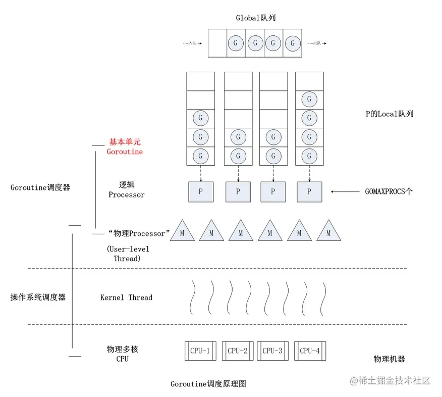
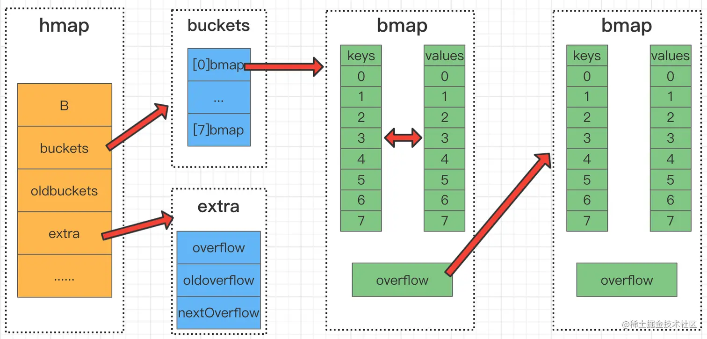

# GO

## 垃圾回收

垃圾回收就是对程序中不再使用的内存资源进行自动回收的操作。

### 常见的垃圾回收算法

- 引用计数：每个对象维护一个引用计数，当被引用对象被创建或被赋值给其他对象时引用计数自动加 +1，如果这个对象被销毁，则计数 -1 ，当计数为 0 时，回收该对象。
  - 优点：对象可以很快被回收，不会出现内存耗尽或到达阀值才回收。
  - 缺点：不能很好的处理循环引用。
- 标记-清除：从根变量开始遍历所有引用的对象，引用的对象标记“被引用”，没有被标记的则进行回收。
  - 优点：解决了引用计数的缺点。
  - 缺点：需要 STW（stop the world），暂时停止程序运行。
- 分代回收：按照对象生命周期长短划分不同的代空间，生命周期长的放入老年代，短的放入新生代，不同代有不同的回收算法和回收频率。
  - 优点：回收性能好。
  - 缺点：算法复杂。

### 三色标记法

- 初始状态下所有对象都是白色的。
- 从根节点开始遍历，把遍历到的对象变成灰色对象。
- 遍历灰色对象，将灰色对象引用的对象也变成灰色对象，同时将自己变成黑色对象。
- 循环步骤 3，直到灰色对象全部变黑色。
- 通过写屏障 (write-barrier) 检测对象有变化，重复以上操作（备注：因为标记和用户程序是并行的，所以在上一步执行的时候可能会有新的对象分配，写屏障是为了解决这个问题引入的）。
- 收集所有白色对象（垃圾）。

### 根对象

- 全局变量：程序在编译期就能确定的那些存在于程序整个生命周期的变量。
- 执行栈：每个 goroutine 都包含自己的执行栈，这些执行栈上包含**栈上的变量**及**指向分配的堆内存区块的指针**。
- 寄存器：寄存器的值可能表示一个指针，参与计算的这些指针可能指向某些赋值器分配的堆内存区块。

### STW（Stop The World）

- 为了避免在 GC 的过程中，对象之间的引用关系发生新的**变更**，使得 GC 的结果发生错误（如 GC 过程中新增了一个引用，但是由于未扫描到该引用导致将被引用的对象清除了），停止所有正在运行的协程。
- STW 对性能有一些影响，Go 目前已经可以做到 1ms 以下的 STW。

### 写屏障（Write Barrier）

为了避免 GC 的过程中新修改的引用关系到 GC 的结果发生错误，我们需要进行 STW，但是 STW 会影响程序的性能，所以我们要通过写屏障技术尽可能地缩短 STW 的时间。

### 混合写屏障机制（Go v1.8）

- GC 刚开始的时候，会将栈上的可达对象全部标记为黑色。
- GC 期间，任何在栈上新创建的对象，均为黑色。
- 堆上被删除的对象标记为灰色。
- 堆上新添加的对象标记为灰色。

**备注：写屏障只应用在堆上。**

### GC 流程（Go v1.8）

- STW (Stop The World) 并开启写屏障，记录根对象的必要信息。
- Start The World 开始标记，此时用户程序和 GC 标记并发执行。
- 标记完成再次 STW，关闭写屏障。
- Start The World 进入清除阶段。

### Go 的内存模型中为什么小对象多了会造成 GC 压力？

通常小对象过多会导致 GC 三色法消耗过多的 CPU，优化思路是，减少对象分配。

### GC 的触发条件？

- 主动触发（手动触发），通过调用 `runtime.GC()` 来触发 GC，此调用阻塞式地等待当前 GC 运行完毕。
- 被动触发，分为两种方式：
  - 使用系统监控，当超过两分钟没有产生任何 GC 时，强制触发 GC。
  - 使用步调（Pacing）算法，其核心思想是控制内存增长的比例，每次内存分配时检查当前内存分配量是否已达到阈值（环境变量GOGC），默认100%，即当内存扩大一倍时启用 GC。

### 辅助 GC（Mutator Assist）

为了防止内存分配过快，在 GC 执行过程中，如果 goroutine 需要分配内存，那么这个 goroutine 会参与一部分 GC 的工作，即帮助 GC 做一部分工作，这个机制叫作 Mutator Assist。

## GPM 调度 和 CSP 模型

### CSP 模型？

CSP 模型是“以通信的方式来共享内存”，不同于传统的多线程通过共享内存来通信。用于描述两个独立的并发实体通过共享的通讯 channel （管道）进行通信的并发模型。

### GPM 分别是什么、分别有多少数量？

- G（Goroutine）： 即 Go 协程，每个 go 关键字都会创建一个协程。
- M（Machine）：工作线程，在 Go 中称为 Machine，数量对应真实的 CPU 数（真正干活的对象）。
- P（Processor）： 处理器（Go中定义的一个摡念，非 CPU），**包含运行 Go 代码的必要资源**，用来调度 G 和 M 之间的关联关系，其数量可通过 `GOMAXPROCS()` 来设置，默认为核心数。

M 必须拥有 P 才可以执行 G 中的代码，P 含有一个包含多个 G 的队列，P 可以调度 G 交由 M 执行。

### Goroutine 调度策略

- 队列轮转：P 会周期性的将 G 调度到 M 中执行，执行一段时间后，保存上下文，将 G 放到队列尾部，然后从队列中再取出一个 G 进行调度。除此之外，P 还会周期性的查看全局队列是否有 G 等待调度到 M 中执行。
- 系统调用：当 G0 即将进入系统调用时，M0 将释放 P，进而某个空闲的 M1 获取 P，继续执行 P 队列中剩下的 G。M1 的来源有可能是 M 的缓存池，也可能是新建的。
  当 G0 系统调用结束后，如果有空闲的 P，则获取一个 P，继续执行 G0。如果没有，则将 G0 放入全局队列，等待被其他的 P 调度。然后 M0 将进入**缓存池**睡眠。

  

## CHAN 原理

### 结构体

```go
type hchan struct {
 qcount   uint  // 队列中的总元素个数
 dataqsiz uint  // 环形队列大小，即可存放元素的个数
 buf      unsafe.Pointer // 环形队列指针
 elemsize uint16  // 每个元素的大小
 closed   uint32  // 标识关闭状态
 elemtype *_type // 元素类型
 sendx    uint   // 发送索引，元素写入时存放到队列中的位置

 recvx    uint   // 接收索引，元素从队列的该位置读出
 recvq    waitq  // 等待读消息的 goroutine 队列
 sendq    waitq  // 等待写消息的 goroutine 队列
 lock mutex  // 互斥锁，chan 不允许并发读写
}
```

### 读写流程

> 向  channel 写数据:
>
> 1. 若等待接收队列  recvq 不为空，则缓冲区中无数据或无缓冲区，将直接从 recvq 取出 G ，并把数据写入，最后把该  G 唤醒，结束发送过程。
> 2. 若缓冲区中有空余位置，则将数据写入缓冲区，结束发送过程。
> 3. 若缓冲区中没有空余位置，则将发送数据写入 G，将当前 G 加入 sendq ，进入睡眠，等待被读  goroutine 唤醒。

> 从 channel 读数据
>
> 1. 若等待发送队列  sendq 不为空，且没有缓冲区，直接从 sendq 中取出 G ，把 G 中数据读出，最后把 G 唤醒，结束读取过程。
> 2. 如果等待发送队列 sendq 不为空，说明缓冲区已满，从缓冲区中首部读出数据，把 G 中数据写入缓冲区尾部，把 G 唤醒，结束读取过程。
> 3. 如果缓冲区中有数据，则从缓冲区取出数据，结束读取过程。
> 4. 将当前 goroutine 加入 recvq ，进入睡眠，等待被写 goroutine 唤醒。

> 关闭 channel
>
> 1.关闭 channel 时会将 recvq 中的 G 全部唤醒，本该写入 G 的数据位置为 nil。将 sendq 中的 G 全部唤醒，但是这些 G 会 panic。
>
> panic 出现的场景还有：
>
> - 关闭值为 nil 的 channel
> - 关闭已经关闭的 channel
> - 向已经关闭的 channel 中写数据

### 无缓冲 chan 的发送和接收是否同步?

```go
// 无缓冲的 channel 由于没有缓冲发送和接收需要同步
ch := make(chan int)   
// 有缓冲 channel 不要求发送和接收操作同步
ch := make(chan int, 2)  
```

channel 无缓冲时，发送阻塞直到数据被接收，接收阻塞直到读到数据；channel 有缓冲时，当缓冲满时发送阻塞，当缓冲空时接收阻塞。

## context 结构原理

### 用途

Context（上下文）是 Go 应用开发常用的并发控制技术 ，它可以控制一组呈树状结构的 goroutine，每个 goroutine 拥有相同的上下文。Context 是并发安全的，主要是用于控制多个协程之间的协作、取消操作。


### 数据结构

Context 只定义了接口，凡是实现该接口的类都可称为是一种 context。

```go
type Context interface {
   Deadline() (deadline time.Time, ok bool)
   Done() <-chan struct{}
   Err() error
   Value(key interface{}) interface{}
}
```

- `Deadline()` 方法：可以获取设置的截止时间，返回值 deadline 是截止时间，到了这个时间，context 会自动发起取消请求，返回值 ok 表示是否设置了截止时间。
- `Done()` 方法：返回一个只读的 channel ，类型为 struct{}。如果这个 chan 可以读取，说明已经发出了取消信号，可以做清理操作，然后退出协程，释放资源。
- `Err()` 方法：返回 context 被取消的原因。
- `Value()` 方法：获取 context 上绑定的值，是一个键值对，通过 key 来获取对应的值。

## 竞态、内存逃逸

### 竞态

资源竞争，就是在程序中，同一块内存同时被多个 goroutine 访问。 我们使用 go build、go run、go test 命令时，添加 `-race` 标识可以检查代码中是否存在资源竞争。

解决这个问题，我们可以给资源进行加锁，让其在同一时刻只能被一个协程来操作。

- `sync.Mutex`
- `sync.RWMutex`

### 逃逸分析

逃逸分析就是程序运行时内存的分配位置（栈或堆），是由编译器来确定的，堆适合不可预知大小的内存分配，但是为此付出的代价是分配速度较慢，而且会形成内存碎片。

逃逸场景：

- 指针逃逸
- 栈空间不足逃逸
- 动态类型逃逸
- 闭包引用对象逃逸

## 快问快答

### Go 中除了加 Mutex 锁以外还有哪些方式安全读写共享变量？

可以通过 chan 安全读写共享变量。

### Go 中 new 和 make 的区别？

- make 仅用来分配及初始化类型为 slice、map、chan 的变量。
- new 可分配任意类型的变量，根据传入的类型申请一块内存，返回指向这块内存的指针，即类型 *Type。
- make 返回引用，即 Type，new 分配的空间被清零，make 分配空间后，会进行初始。

### Go 中对 nil 的 slice 和空 slice 的处理是一致的吗?

首先 Go 的 JSON 标准库对 nil slice 和空 slice 的处理是不一致的：

- slice := make([]int, 0）：slice 不为 nil，但是 slice 没有值，slice 的底层的空间是空的。
- var slice []int 的值是 nil，可用于需要返回 slice 的函数，当函数出现异常的时候，保证函数依然会有 nil 的返回值。

### 协程和线程和进程的区别？

- 进程: 进程是具有一定独立功能的程序，进程是系统资源分配和调度的最小单位。 每个进程都有自己的独立内存空间，不同进程通过进程间通信来通信。由于进程比较重量，占据独立的内存，所以上下文进程间的切换开销（栈、寄存器、虚拟内存、文件句柄等）比较大，但相对比较稳定安全。
- 线程: 线程是进程的一个实体，线程是内核态，而且是 CPU 调度和分派的基本单位，它是比进程更小的能独立运行的基本单位。线程间通信主要通过共享内存，上下文切换很快，资源开销较少，但相比进程不够稳定容易丢失数据。
- 协程: 协程是一种用户态的轻量级线程，协程的调度完全是由用户来控制的。协程拥有自己的寄存器上下文和栈。 协程调度切换时，将寄存器上下文和栈保存到其他地方，在切回来的时候，恢复先前保存的寄存器上下文和栈，直接操作栈则基本没有内核切换的开销，可以不加锁的访问全局变量，所以上下文的切换非常快。

### channel 为什么它可以做到线程安全？

channel 可以理解是一个先进先出的队列，通过管道进行通信，发送一个数据到 channel 和从 channel 接收一个数据都是原子性的。不要通过共享内存来通信，而是通过通信来共享内存，前者就是传统的加锁，后者就是 channel。设计 channel 的主要目的就是在多任务间传递数据的，本身就是安全的。

### 怎么查看 Goroutine 的数量？怎么限制 Goroutine 的数量？

- 在 Go 中，GOMAXPROCS 中控制的是未被阻塞的所有 Goroutine，可以被 Multiplex 到多少个线程上运行，通过GOMAXPROCS 可以查看 Goroutine 的数量。
- 使用通道，每次执行的 go 之前向通道写入值，直到通道满的时候就阻塞了。

### channel 是同步的还是异步的？

channel 是异步进行的， channel 存在 3 种状态：

- nil，未初始化的状态，只进行了声明，或者手动赋值为 nil
- active，正常的 channel，可读或者可写
- closed，已关闭，千万不要误认为关闭 channel 后，channel 的值是nil

| 操作     | 一个零值 nil 通道 | 一个非零值但已关闭的通道 | 一个非零值且尚未关闭的通道 |
| -------- | ----------------- | ------------------------ | -------------------------- |
| 关闭     | 产生恐慌          | 产生恐慌                 | 成功关闭                   |
| 发送数据 | 永久阻塞          | 产生恐慌                 | 阻塞或者成功发送           |
| 接收数据 | 永久阻塞          | 永不阻塞                 | 阻塞或者成功接收           |

### Goroutine 和线程的区别？

- 一个线程可以有多个协程。
- 线程、进程都是同步机制，而协程是异步。
- 协程可以保留上一次调用时的状态，当过程重入时，相当于进入了上一次的调用状态。
- 协程是需要线程来承载运行的，所以协程并不能取代线程，线程是被分割的 CPU 资源，协程是组织好的代码流程。

### Go 的 struct能不能比较？

- 相同 struct 类型的可以比较。
- 不同 struct 类型的不可以比较，编译都不过，类型不匹配。

### Go 主协程如何等其余协程完再操作？

使用 `sync.WaitGroup`。`WaitGroup`，就是用来等待一组操作完成的。`WaitGroup` 内部实现了一个计数器，用来记录未完成的操作个数。`Add()` 用来添加计数，`Done()` 用来在操作结束时调用，使计数减一，`Wait()` 用来等待所有的操作结束，即计数变为 0，该函数会在计数不为 0 时等待，在计数为 0 时立即返回。

```go
func TestWaitgroup(t *testing.T) {
   var wg sync.WaitGroup
   wg.Add(2)
   go func() {
      sendHttpRequest("https://baidu.com")
      wg.Done()
   }()
   go func() {
      sendHttpRequest("https://baidu.com")
      wg.Done()
   }()
   wg.Wait()
}
```


### Go 的 slice 如何扩容？

在使用 append 向 slice 追加元素时，若 slice 空间不足则会发生扩容，扩容会重新分配一块更大的内存，将原 slice 拷贝到新 slice ，然后返回新 slice，扩容后再将数据追加进去。

扩容操作只对容量，扩容后的 slice 长度不变，容量变化规则如下：

- 若 slice 容量小于 1024 个元素，那么扩容的时候 slice 的 cap 就翻番，乘以 2，一旦元素个数超过 1024 个元素，增长因子就变成 1.25，即每次增加原来容量的四分之一。
- 若 slice 容量够用，则将新元素追加进去，`slice.len++`，返回原 slice
- 若 slice 容量不够用，将 slice 先扩容，扩容得到新 slice，将新元素追加进新 slice，`slice.len++`，返回新 slice。

### Go 中的 map 如何实现顺序读取？

Go 中 map 如果要实现顺序读取的话，可以先把 map 中的 key，通过 sort 包排序。

### Go 值接收者和指针接收者的区别？

方法的接收者:

- 值类型，既可以调用值接收者的方法，也可以调用指针接收者的方法；
- 指针类型，既可以调用指针接收者的方法，也可以调用值接收者的方法。

但是接口的实现，值类型接收者和指针类型接收者不一样：

- 以值类型接收者实现接口，类型本身和该类型的指针类型，都实现了该接口；
- 以指针类型接收者实现接口，只有对应的指针类型才被认为实现了接口。

通常我们使用指针作为方法的接收者的理由：

- 使用指针方法能够修改接收者指向的值。
- 可以避免在每次调用方法时复制该值，在值的类型为大型结构体时，这样做会更加高效。

### 在 Go 函数中为什么会发生内存泄露？

Goroutine 需要维护执行用户代码的上下文信息，在运行过程中需要消耗一定的内存来保存这类信息，如果一个程序持续不断地产生新的 goroutine，且不结束已经创建的 goroutine 并复用这部分内存，就会造成内存泄漏的现象。

### Goroutine 发生了泄漏如何检测？

可以通过 Go 自带的工具 pprof 或者使用 Gops 去检测诊断当前在系统上运行的 Go 程的占用的资源。

### Go 中两个 Nil 可能不相等吗？

Go中两个 Nil 可能不相等。

接口(interface) 是对非接口值(例如指针，struct 等)的封装，内部实现包含 2 个字段，类型 T 和 值 V。**一个接口等于 nil，当且仅当 T 和 V 处于 unset 状态（T=nil, V is unset）**。
两个接口值比较时，会先比较 T，再比较 V。 接口值与非接口值比较时，会先将非接口值尝试转换为接口值，再比较。

```go
func main() {
	var p *int = nil
	var i interface{} = p
	fmt.Println(i == p) // true
	fmt.Println(p == nil) // true
	fmt.Println(i == nil) // false
}
```

### Go 语言函数传参是值类型还是引用类型？

- 在Go语言中只存在值传递，要么是值的副本，要么是指针的副本。无论是值类型的变量还是引用类型的变量亦或是指针类型的变量作为参数传递都会发生值拷贝，开辟新的内存空间。
- 另外值传递、引用传递和值类型、引用类型是两个不同的概念，不要混淆了。引用类型作为变量传递可以影响到函数外部是因为发生值拷贝后新旧变量指向了相同的内存地址。

### Go语言中的内存对齐了解吗？

CPU 访问内存时，并不是逐个字节访问，而是以**字长（word size）**为单位访问，比如 32 位的 CPU ，字长为 4 字节，那么 CPU 访问内存的单位也是 4 字节。
CPU 始终以字长访问内存，如果不进行内存对齐，很可能增加 CPU 访问内存的次数，例如：


变量 a、b 各占据 3 字节的空间，内存对齐后，a、b 占据 4 字节空间，CPU 读取 b 变量的值只需要进行一次内存访问。如果不进行内存对齐，CPU 读取 b 变量的值需要进行 2 次内存访问。第一次访问得到 b 变量的第 1 个字节，第二次访问得到 b 变量的后两个字节。
也可以看到，内存对齐对实现变量的原子性操作也是有好处的，每次内存访问是原子的，如果变量的大小不超过字长，那么内存对齐后，对该变量的访问就是原子的，这个特性在并发场景下至关重要。
简言之：合理的内存对齐可以提高内存读写的性能，并且便于实现变量操作的原子性。

### 两个 interface 可以比较吗？

- 判断类型是否一样

```
reflect.TypeOf(a).Kind() == reflect.TypeOf(b).Kind()
```

- 判断两个 interface{} 是否相等

```
reflect.DeepEqual(a, b interface{})
```

- 将一个 interface{} 赋值给另一个 interface{}

```
reflect.ValueOf(a).Elem().Set(reflect.ValueOf(b))
```

### go 打印时 %v %+v %#v 的区别？

- %v 只输出所有的值。
- %+v 先输出字段名字，再输出该字段的值。
- %#v 先输出结构体名字值，再输出结构体（字段名字+字段的值）。

```go
package main
import "fmt"
 
type student struct {
	id   int32
	name string
}
 
func main() {
	a := &student{id: 1, name: "小明"}
	fmt.Printf("a=%v\n", a) // a=&{1 小明}	
	fmt.Printf("a=%+v\n", a) // a=&{id:1 name:小明}	
	fmt.Printf("a=%#v\n", a) // a=&main.student{id:1, name:"小明"}
}
```

### 什么是 rune 类型？

Go语言的字符有以下两种：

- uint8 类型，或者叫 byte 型，代表了 ASCII 码的一个字符。
- rune 类型，代表一个 UTF-8 字符，当需要处理中文、日文或者其他复合字符时，则需要用到 rune 类型。rune 类型等价于 int32 类型。
- 使用 `for _, c := range str` 遍历字符串时 c 为 rune 类型。

### 空 struct{} 占用空间么？

可以使用 `unsafe.Sizeof` 计算出一个数据类型实例需要占用的字节数，空结构体 struct{} 实例不占据任何的内存空间。

### 空 struct{} 的用途？

因为空结构体不占据内存空间，因此被广泛作为各种场景下的占位符使用。

- 将 map 作为集合使用时，可以将值类型定义为空结构体，仅作为占位符使用即可。
- 不发送数据的 channel `chan struct{}`，只用来通知子协程执行任务，或只用来控制协程并发度。
- 结构体只包含方法，不包含任何的字段。

### 数组和切片的区别

- 相同点：
  - 只能存储一组相同类型的数据结构。
  - 都是通过下标来访问，并且有容量长度，长度通过 `len` 获取，容量通过 `cap` 获取。

- 区别：
  - 数组是定长，访问和复制不能超过数组定义的长度，否则就会下标越界，切片长度和容量可以自动扩容。
  - 数组是值类型，切片是引用类型，每个切片都引用了一个底层数组，切片本身不能存储任何数据，都是这底层数组存储数据，所以修改切片的时候修改的是底层数组中的数据。切片一旦扩容，指向一个新的底层数组，内存地址也就随之改变。

### for range 的时候它的地址会发生变化么？

在 for a,b := range c 遍历中， a 和 b 在内存中只会存在一份，即之后每次循环时遍历到的数据都是以值覆盖的方式赋给 a 和 b，a、b 的内存地址始终不变。由于有这个特性，for 循环里面如果开协程，不要直接把 a 或者 b 的地址传给协程。解决办法：在每次循环时，创建一个临时变量。

### go defer，多个 defer 的顺序，defer 在什么时机会修改返回值？

**作用：**defer 延迟函数、释放资源、收尾工作、如释放锁、关闭文件、关闭链接、捕获 panic。

**避坑指南：**defer 函数紧跟在资源打开后面，否则 defer 可能得不到执行，导致内存泄露。

**多个 defer 调用顺序：** LIFO（后入先出），defer 后的操作可以理解为压入栈中。

修改返回值：defer，return，return value（函数返回值） 执行顺序：首先 return，其次 return value，最后 defer。defer 可以修改函数最终返回值，修改时机：**有名返回值或者函数返回指针**。

### Go 中解析 tag 是怎么实现的？反射原理是什么？

Go 中解析的 tag 是通过反射实现的，反射是指计算机程序在运行时（Run time）可以访问、检测和修改它本身状态或行为的一种能力或动态知道给定数据对象的类型和结构，并有机会修改它。

### 25个关键字

break, case, chan, const, continue, default, defer, else, fallthrough, for, func, go, goto, if, import, interface, map, package, range, return, select, struct, switch, type, var

### 基础问题

- 每个可独立运行的 go 程序都必须有且仅有一个 main 包，只有 package 名称为 main 的源码文件可以包含 main 函数。
- main 函数是每一个可执行程序所必须包含的，一般来说都是在启动后第一个执行的函数（如果有 init 函数则会先执行该函数）。
- 首字母大写的标识符是可导出的，否则是仅包内可见。
- 文件名和包名没有直接关系，文件夹名和包名没有直接关系，同一个文件夹下的文件只能有一个包名，否则编译报错。
- go mod使用本地包的方法，在go.mod文件中加入replace example.com/test/sub =\> ./sub。
- v, ok := \<- ch可用于判断通道是否已经关闭。
- 关闭带缓冲的通道并不会丢失里面的数据，只是让读取通道数据的时候不会读完之后一直阻塞等待新数据写入。
- 类型转换，type_name(expression)。
- 如果不初始化 map，那么就会创建一个 nil map，nil map 不能用来存放键值对。
- 当要将结构体对象转换为 JSON 时，对象中的属性首字母必须是大写，才能正常转换为 JSON。

### 怎么处理对 map 进行并发访问？

sync.Map

### Go 如何实现原子操作？

sync/atomic

### map 底层实现和扩容？

在 go 的 map 实现中，它的底层结构体是 hmap，hmap 里维护着若干个 bucket 数组 （即桶数组）。

bucket 数组中每个元素都是 bmap 结构，也即每个 bucket（桶）都是 bmap 结构，每个桶中保存了 8 个 k/v 对，如果 8 个满了，又来了一个 key 落在了这个桶里，会使用 overflow 连接下一个桶（溢出桶）。



### 删除 map 中单个 key 会不会释放内存？

不会。
