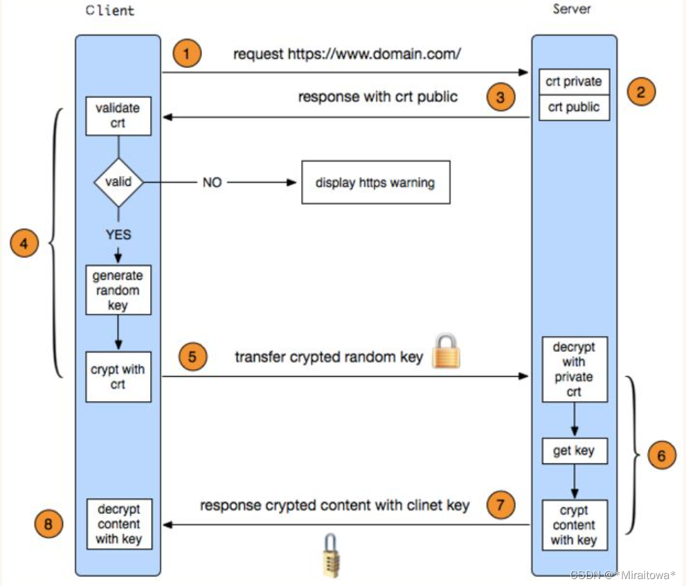

# HTTP

## HTTP/1.0、HTTP/1.1 和 HTTP/2 在利用 TCP 请求上的差异？

HTTP/1.0 中的每个请求都会建立一个单独 TCP 连接。

HTTP/1.1 中默认开启 keep-alive，使得多个请求可以复用一个 TCP 连接，但是 HTTP 的传输是一问一答的形式，必须等上一个请求结束才能执行当前请求，所以会受到前面请求的阻塞。

HTTP/2 采用二进制格式传输，取代了 HTTP/1.x 的文本格式，解析更高效。多路复用代替了 HTTP/1.x 的序列和阻塞机制，所有的相同域名请求都通过同一个 TCP 连接并发完成，消除了因多个 TCP 连接而带来的延时和内存消耗。单个连接上可以并行交错的请求和响应，之间互不干扰（主要通过 HTTP/2 stream 概念和 stream-id 来实现）。

## HTTPS 连接过程？

## GET 和 POST 请求有哪些区别？

- GET 请求会被浏览器主动缓存，而 POST 不会。
- GET 传递参数有大小限制，而 POST 没有。
- POST 参数传输更安全，GET 的参数会明文限制在 URL 上，POST 不会。

## HTTP 响应码 301 和 302？

301 表示永久重定向，302 表示暂时重定向。

## 常见 HTTP 状态码有哪些？

**1xx**：处理信息，服务器收到请求，需要请求者继续执行操作。
**2xx**：请求成功。
**3xx**：重定向。
**4xx**：客户端错误。
**5xx**：服务器错误。

## session 和 cookie？

**存储位置不同**，session 存储在服务器端，cookie 存储在浏览器端；**安全性不同**，cookie 安全性一般，在浏览器存储，可以被伪造和修改；**容量和个数限制**，cookie 有容量限制，每个站点下的 cookie 也有个数限制；**存储的多样性**，session可以存储在 Redis 中、数据库中、应用程序中，而 cookie 只能存储在浏览器中。

## session 的工作原理？

session 的工作原理是客户端登录完成之后，服务器会创建对应的 session，session 创建完之后，会把 session 的 id 发送给客户端，客户端再存储到浏览器中，这样客户端每次访问服务器时，都会带着 session id，服务器拿到 session id 之后，在内存找到与之对应的 session 这样就可以正常工作了。

客户端禁止 cookie 不会影响 session 的使用（**cookie 只是存储方式**），session 只是依赖 cookie 存储 session id，如果 cookie 被禁用了，可以使用 URL 中添加 session id 的方式保证 session 能正常使用。

## 限流常用方法？

计数器（固定窗口）算法，滑动窗口算法，漏桶算法、令牌桶算法。

## forward（转发） 和 redirect（重定向） 的区别？

**地址栏 URL**：forward URL 不会发生改变，redirect URL 会发生改变。

**数据共享**：forward 可以共享 request 里的数据，redirect不能共享。

**效率**：forward 比 redirect 效率高。
