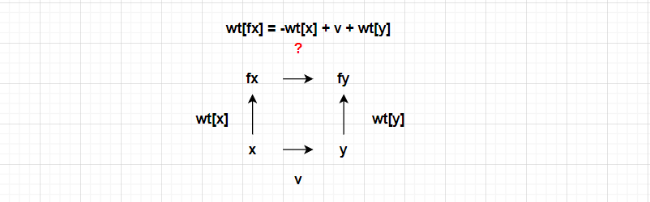

# 并查集

并查集常用来解决分组问题，也可以用于检测环，时间复杂度较低，可以在近乎常数时间内完成操作。

## 路径压缩+按秩合并

```go
package main

// members 表示所有成员，relationship 表示成员之间有连接（其中的值为 members 下标）
func demo(members []int, relationship [][]int) {
    // 注意这里 fa 中值表示 members 下标，rank 可以认为是树的高度
	fa, rank := make([]int, len(members)), make([]int, len(members))
	groupCnt := len(members) // groupCnt 初始值等于全体的数量
	for i := range fa {
		fa[i] = i
		rank[i] = 1
	}
	for _, rel := range relationship {
		if !connected(fa, rel[0], rel[1]) {
			merge(fa, rank, rel[0], rel[1])
			groupCnt--
		}
	}
}

func find(fa []int, x int) int {
	if fa[x] == x {
		return x
	}
    // 递归找父亲
	fa[x] = find(fa, fa[x])
	return fa[x]
}

func connected(fa []int, x, y int) bool {
	return find(fa, x) == find(fa, y)
}

func merge(fa, rank []int, x, y int) {
	fx, fy := find(fa, x), find(fa, y)
	if fx == fy {
		return
	}
	if rank[fx] >= rank[fy] {
		fa[fy] = fx
	} else {
		fa[fx] = fy
	}
    // 如果两边秩相等，父节点的秩加一
	if rank[fx] == rank[fy] {
		rank[fx]++
	}
}
```

## 路径压缩+带权值并查集
```go
package main

// members 表示所有成员，relationship 表示成员之间有连接（其中的值为 members 下标），
// relationshipValues 对应 relationship 中连接的值（注意连接方向，这个例子中表示从
// relationship[i][0] 到 relationship[i][1]的值）
func demo(members []int, relationship [][]int, relationshipValues []int) {
    // 注意这里 fa 中值表示 members 下标，wt 表示到其父节点的值
	fa, wt := make([]int, len(members)), make([]int, len(members))
    for i := range fa {
        fa[i] = i
        wt[i] = 0
    }
    for i, rel := range relationship {
		merge(fa, rel[0], rel[1], relationshipValues[i], wt)
	}
}

func find(fa []int, x int, wt []int) int {
    if x == fa[x] {
        return x
    }
    f := fa[x]
    // 递归找父亲
    fa[x] = find(fa, fa[x], wt)
    wt[x] += wt[f]
    return fa[x]
}

func merge(fa []int, x, y, v int, wt []int) {
    fx, fy := find(fa, x, wt), find(fa, y, wt)
    if fx == fy {
        return
    }
    fa[fx] = fy
    wt[fx] = -wt[x] + v + wt[y] // 这里可以画向量图来理解
}
```

